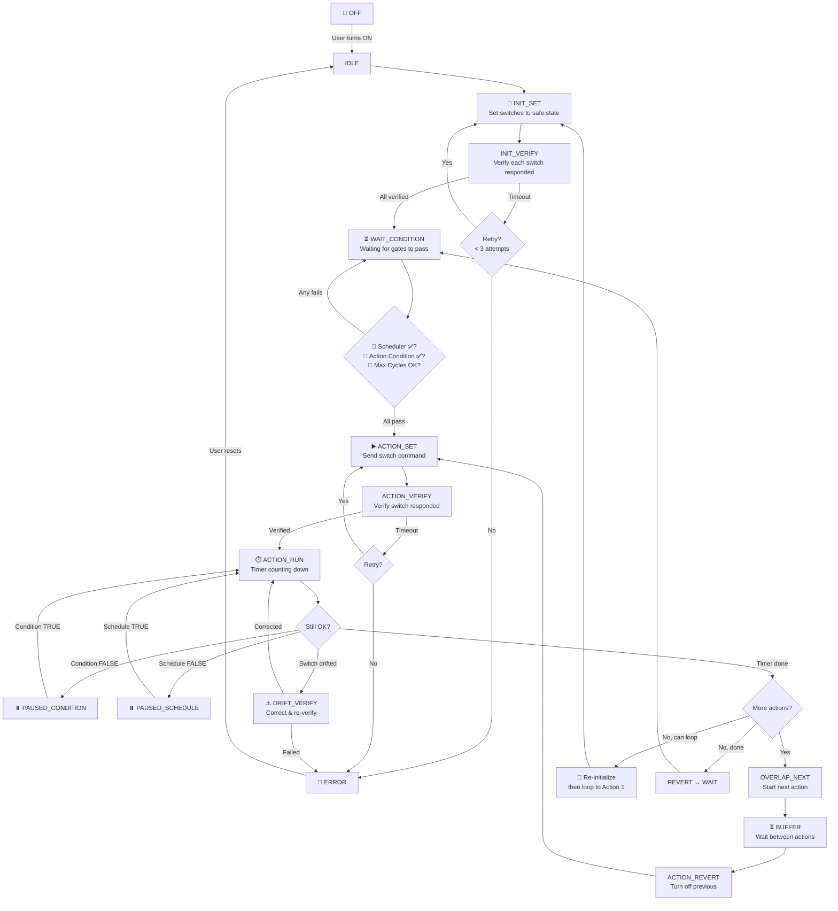
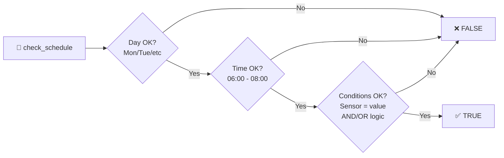
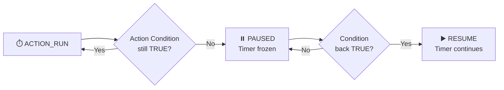
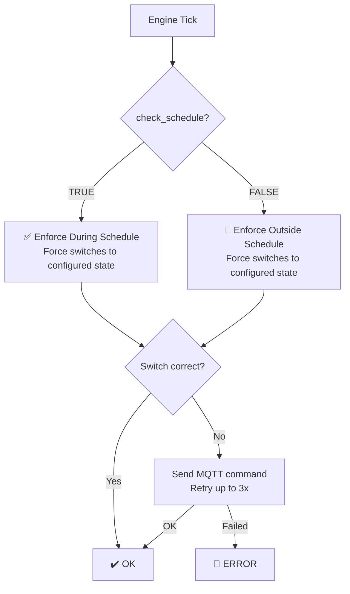
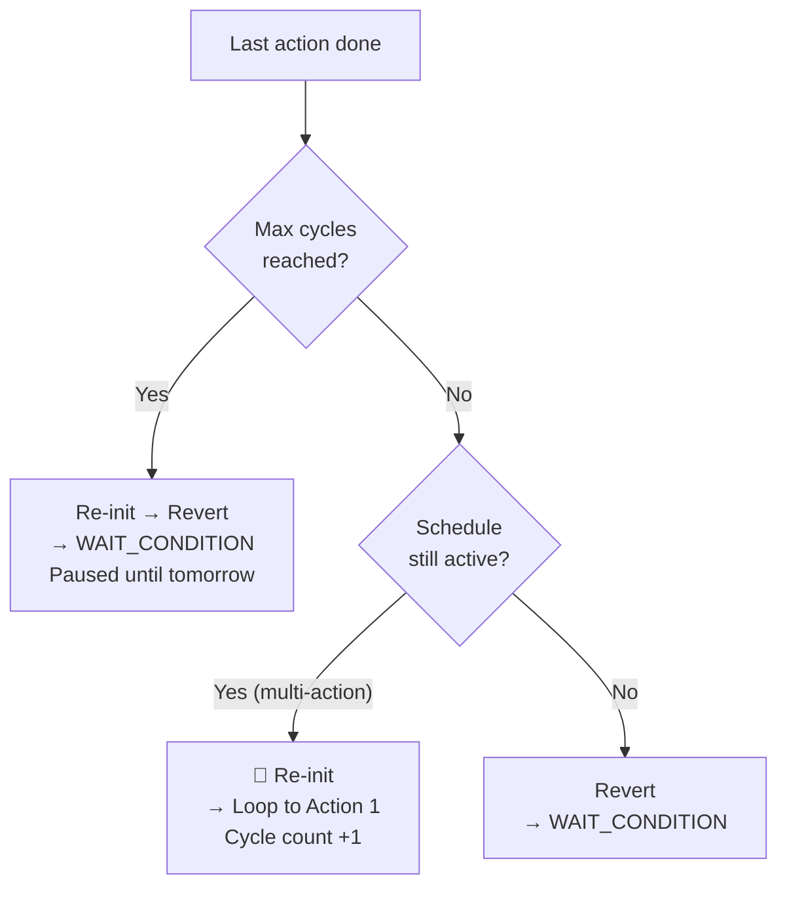

# Nivixsa Smart Irrigation Dashboard — Architecture & Security

This document outlines the complete working mechanics, security layers, AI integration, and notification infrastructure for the Nivixsa Smart Irrigation system.

---

## 1. High-Level Overview

Nivixsa is a multi-user IoT dashboard designed for the CADIO ecosystem. It provides a deterministic state machine for irrigation control, a persistent background automation engine, and a weather-aware AI scheduler — all accessible from any device as a Progressive Web App (PWA).

The system is built on **Python (Flask/SocketIO)** with an **SQLite** persistence layer, using **MQTT** for low-latency communication with hardware switches, and **VAPID Web Push** for cross-platform native notifications.

```
┌──────────────────────────────────────────────────────────┐
│                   Nivixsa Server (Flask)                  │
│  ┌─────────┐  ┌──────────┐  ┌──────────┐  ┌───────────┐ │
│  │ SocketIO │  │ AI Agent │  │  Engine  │  │ Push Svc  │ │
│  │  (Live)  │  │ (Gemini) │  │  (State) │  │ (VAPID)   │ │
│  └────┬─────┘  └────┬─────┘  └────┬─────┘  └─────┬─────┘ │
│       │              │             │              │       │
│  ┌────┴──────────────┴─────────────┴──────────────┴────┐ │
│  │              SQLite Database (Encrypted)             │ │
│  └──────────────────────────────────────────────────────┘ │
└───────────┬──────────────────────────────────┬───────────┘
            │ MQTT                              │ HTTPS/WSS
    ┌───────┴───────┐                  ┌───────┴───────────┐
    │  ESP8266/32   │                  │  PWA Dashboard    │
    │  (Hardware)   │                  │  (Browser/Mobile) │
    └───────────────┘                  └───────────────────┘
```

---

## 2. Multi-User & Security Architecture

### Secure Identity Management
*   **Database (SQLite)**: Stores users, automations, push subscriptions, and logs.
*   **Encrypted Credentials**: 
    *   Passwords are stored as **Bcrypt** hashes (for authentication).
    *   Original CADIO passwords and API Keys are stored using **Fernet (AES-128)** encryption, ensuring that even if the database is leaked, raw credentials remain protected.
*   **Session Token Validation**: Browser sessions are validated against server-issued tokens stored in the database. Stale or hijacked tokens are rejected.

### Account Block & Recovery (Anti-Ban)
To prevent CADIO from banning your account due to repeated login attempts (e.g., during network issues):
1.  **Failure Detection**: If the MQTT broker rejects credentials (`rc=4`), the system increments a failure counter.
2.  **Auto-Block**: After **3 consecutive failures**, the account is marked as `Blocked` in the database.
3.  **Spam Prevention**: All reconnect attempts are halted immediately once an account is blocked.
4.  **Self-Healing**: The block is automatically lifted once the user successfully logs in again through the dashboard UI.

### Admin Command Center
*   **Multi-Level Admin System**: Level 1 (Master Admin) can block/unblock users, force logout, impersonate, and manage other admins. Level 2/3 have restricted views.
*   **OTP-Secured Impersonation**: Admin impersonation requires a dynamically generated One-Time Password (OTP), preventing unauthorized access even with admin credentials.
*   **Real-Time Telemetry**: Background loop sends CPU/RAM/DB health metrics to the admin dashboard every 5 seconds via dedicated `admin_room` SocketIO channel.

---

## 3. Automation Engine (The State Machine)

The engine transitions between predefined states to ensure complete safety.

### State Lifecycle
```
IDLE → INIT_SET → INIT_VERIFY → ACTION_SET → ACTION_VERIFY →
ACTION_RUN (timer) → BUFFER_WAIT → (next action or COMPLETED) → IDLE
                     ↓ (drift)          ↓ (drift)
              ACTION_DRIFT_VERIFY   BUFFER_DRIFT_VERIFY
                     ↓ (fail)
              ERROR_SET → ERROR_VERIFY → ERROR (safe shutdown)
```

### Verification-Driven Logic
Unlike simple "Send and Forget" systems, Nivixsa uses a **Set -> Verify -> Proceed** loop:
*   **Sequential Initialization**: Every valve/pump is verified to be in a safe "OFF" state before any watering cycle begins.
*   **Real-time Monitoring**: The engine waits for the hardware to confirm its state over MQTT before moving to the next step.
*   **Failsafe Recovery**: If a switch fails to respond after 3 retries, the system enters `ERROR_SET` and attempts to shut down all valves to prevent flooding.

### Drift Detection & Self-Correction
The engine continuously monitors switch states during operation:
*   **Active Cycle Drift**: If a switch unexpectedly changes state during `ACTION_RUN`, the engine detects the drift, re-issues the correct command, and enters `ACTION_DRIFT_VERIFY` to confirm correction.
*   **Buffer Period Drift**: Same protection during cooldown/buffer periods between actions.
*   **Retry & Escalate**: Up to 3 correction attempts before entering emergency `ERROR_SET` mode with full shutdown.
*   **Notifications**: Drift events trigger real-time warning notifications to the user.

### Live Sequence Editing
Users can add, remove, or reorder actions while the automation is actively running:
*   The engine tracks the current action by its MQTT topic identifier.
*   When the action list changes mid-cycle, the engine locates where the current action moved in the new list and adjusts its index automatically.
*   If the active action is deleted, the engine safely resets to `IDLE`.

### Daily Cycle Limits
*   **Max Cycles Per Day**: Each automation supports a configurable daily cycle cap (`maxCyclesPerDay`).
*   The counter resets at midnight (per the automation's timezone).
*   When the limit is reached, the automation stops cycling until the next day.

### 24/7 Persistent Operation
The automation engine runs in a separate Python background thread. 
*   ✅ Closing your browser does **NOT** stop the irrigation.
*   ✅ The server continues to monitor time, weather, and MQTT signals 24/7.
*   ✅ Background tasks automatically resume after a power outage or server reboot.

---

## 4. AI-Driven Scheduling (Google Gemini)

Nivixsa uses **Google Gemini (1.5 Flash/Pro)** to decide *when* to water, replacing static schedules with intelligence.

### Shared vs. Personal AI Modes
1.  **Shared AI (Default)**: Uses the server's built-in Gemini API key. This is the easiest "Plug and Play" option.
2.  **Personal AI**: Users can provide their own Gemini API Key from [Google AI Studio](https://aistudio.google.com/app/apikey).
    *   This provides higher rate limits and avoids sharing quota with other users.
    *   The system dynamically swaps the API client in memory whenever it runs an automation for a "Personal AI" user.

### Decision Intelligence
*   **Weather Fetching**: Queries Open-Meteo for a 10-day window (3 days history + 7 days forecast).
*   **Rain Avoidance**: Automatically skips watering if rainfall is detected in the recent past or predicted for the near future.
*   **Smart Selection**: Analyzes temperatures and humidity to choose the optimal days for hydration.
*   **Safety-First**: If the automation is actively running a cycle, the AI will never remove the current day from the schedule.

### AI Toggle Safety Lock
To prevent race conditions when the AI is calculating:
*   **Server-Side Lock**: A global `_ai_running_set` tracks which automations are mid-calculation. The flag is injected into every `automation_update` broadcast as `ai_running: true/false`.
*   **Client-Side Enforcement**: While `ai_running` is true, the toggle switch is disabled, the settings button is locked, and a pulsating `(Calculating...)` indicator is displayed.
*   **Forced Revert**: Attempting to click the disabled toggle triggers a warning toast notification and the checkbox state is forcibly reverted.
*   **Guaranteed Unlock**: The lock is released in a `finally` block, ensuring the UI unlocks even if the API request fails, times out, or the server throws an exception.

### Error Resilience & Retry
*   **Attempt Counter**: Tracks consecutive failures (up to 3 strikes).
*   **Staggered Retries**: Parses API rate-limit headers and adds progressive buffers (+1 min for 1st fail, +5 min for 2nd fail).
*   **Strike 3 Fallback**: After 3 failures, waits 30 minutes before the next attempt, then resets the counter.

### Scheduled Execution
*   **Daily Run at 2:00 AM**: The AI scheduler runs daily at 2:00 AM in each automation's configured timezone.
*   **On-Save Trigger**: Toggling AI ON or saving automation settings triggers an immediate AI calculation.

---

## 5. Progressive Web App (PWA)

Nivixsa is installable as a native-like app on any device.

### PWA Configuration
*   **Manifest**: Configured with `standalone` display mode, dark theme (`#0d1117`), and optimized maskable icons for all platforms.
*   **Service Worker**: Implements a dual caching strategy:
    *   **Static assets** (CSS, images, icons): Cache-first for instant loads.
    *   **HTML pages**: Network-first with cache fallback for offline access.
*   **Offline Fallback**: When the network is unavailable, a clean "Nivixsa is Offline" page is served from cache.

### Platform Support
| Feature | iOS (Safari) | Android (Chrome) | Desktop (Chrome/Edge) |
|:---|:---:|:---:|:---:|
| Install to Home Screen | ✅ | ✅ | ✅ |
| Background Notifications | ✅ (iOS 16.4+) | ✅ | ✅ |
| Offline Dashboard Shell | ✅ | ✅ | ✅ |

---

## 6. Notification System

Nivixsa uses a dual-channel notification strategy to ensure alerts always reach the user.

### Foreground: Premium Toast Notifications
*   **Glassmorphic Design**: Backdrop-blur, smooth slide-in animations with cubic-bezier bounce.
*   **4 Severity Levels**: `info` (blue), `success` (green), `warning` (yellow), `error` (red) — each with distinct color accents and Material icons.
*   **Auto-Dismiss**: Toasts disappear after 6 seconds with a manual close button.
*   **XSS-Safe**: All content is escaped through `escHtml()` before rendering.
*   **Cross-Module Access**: Exposed globally as `window.showToastNotification()` for use across JS files.

### Background: VAPID Web Push
*   **W3C Standard Protocol**: Uses the VAPID (Voluntary Application Server Identification) protocol for secure, authenticated push messages.
*   **Non-Blocking Delivery**: Push notifications are dispatched in daemon threads via `pywebpush`, never blocking the main event loop.
*   **Expired Subscription Pruning**: Automatically removes dead device endpoints (HTTP 410/404 responses) from the database.
*   **Lock Screen Support**: Notifications appear natively on lock screens with app icon, badge, vibration pattern, and tap-to-open behavior.

### Notification Events
| Trigger | Title | Type |
|:---|:---|:---|
| MQTT Broker Connected | Broker Connected | ✅ success |
| MQTT Broker Failed | Broker Connection Failed | 🔴 error |
| MQTT Broker Disconnected | Broker Disconnected | 🔴 error |
| AI Schedule Updated | 🤖 AI Agronomist Schedule Update | ✅ success |
| Automation Error | 🚨 Automation Error | 🔴 error |
| Drift Detected | ⚠️ Controller Drift Warning | ⚠️ warning |
| Cycle Started | 💧 Irrigation Cycle Started | ✅ success |
| Cycle Completed | ✅ Cycle Completed | ✅ success |
| User Paused/Resumed | ⏸️ / ▶️ Automation State | ℹ️ info |

### Account-Aware Push Management
*   **Per-User Targeting**: Notifications are routed to the correct user via SocketIO rooms (`user_{email}`).
*   **Logout Cleanup**: On logout, the device's push subscription is unregistered from both the browser (via `sub.unsubscribe()`) and the server database (via `POST /api/push/unsubscribe`).
*   **Account Switching**: The database uses `ON CONFLICT(endpoint) DO UPDATE` to automatically reassign a device's push token to the newly logged-in account, preventing cross-account notification leaks.

---

## 7. Timezone-Aware Operation

All time-sensitive operations respect per-user timezones:
*   **Client-Side Detection**: The browser sends its `getTimezoneOffset()` value during login.
*   **Server-Side Application**: The automation engine, AI scheduler (2 AM trigger), daily cycle counters, and log timestamps all use the user's local timezone.
*   **UTC Storage**: All database timestamps are stored in UTC for consistency, converted to local time only for display and scheduling logic.

---

## 8. Hardware Compatibility

The system is optimized for **CADIO-enabled switches** (ESP8266/ESP32) but supports any MQTT-compliant relay that follows the Home Assistant Discovery protocol or standard State/Set topic patterns.

### Communication Protocol
*   **Command Topics**: `{prefix}/set` — sends ON/OFF commands to hardware.
*   **State Topics**: `{prefix}/state` — receives real-time state confirmations from hardware.
*   **QoS Level 1**: Ensures at-least-once delivery for critical irrigation commands.

### Recommended Server Hardware
*   **Raspberry Pi 4 (4GB)**: Recommended for the best balance of stability and performance.
*   **Old Laptop/Mini PC**: Running Linux (Ubuntu Server) provides the fastest response times and highest reliability.
*   **Cloud VPS**: Any Linux VPS with 1GB RAM can host the dashboard for remote access without port forwarding.

---

## 9. Automation Engine — Complete Flow Diagrams

Visual representation of every state transition, gate check, and error recovery path in the automation engine.

### 9.1 High-Level State Machine



### 9.2 Scheduler Gate (3 Sub-Checks)

The scheduler evaluates 3 gates in order. All must pass for the schedule to be considered "active":



### 9.3 Action Condition — Pause/Resume During ACTION_RUN

While an action is running, if the action condition becomes false, the timer freezes and resumes when it becomes true again:



### 9.4 Schedule Enforcement (Background)

Runs independently on every engine tick, regardless of the automation's current state:



### 9.5 Cycle Looping Logic

After the last action finishes, the engine decides whether to loop or stop:



### 9.6 WAIT_CONDITION — Decision Matrix

Both the Scheduler and Action Condition must pass simultaneously. Max cycle limit is also checked.

| 📅 Scheduler | 🔀 Action Condition | 🔄 Cycles OK | Result |
|:---|:---|:---|:---|
| ✅ True | ✅ True | ✅ Under limit | ▶️ **Actions start** |
| ✅ True | ✅ True | ❌ Limit reached | ⏳ Waiting until tomorrow |
| ✅ True | ❌ False | — | ⏳ Waiting (condition not met) |
| ❌ False | ✅ True | — | ⏳ Waiting (outside schedule) |
| ❌ False | ❌ False | — | ⏳ Waiting (both fail) |

### 9.7 Complete State Reference

| State | Description |
|:------|:------------|
| `IDLE` | Off, waiting to be turned on |
| `INIT_SET` | Sending initialization switch commands |
| `INIT_VERIFY_INDIVIDUAL` | Verifying each init switch one by one |
| `INIT_VERIFY_ALL` | Final bulk verification of all init switches |
| `WAIT_CONDITION` | Waiting for Scheduler ✅ AND Action Condition ✅ |
| `ACTION_SET` | Sending action switch command |
| `ACTION_VERIFY` | Verifying action switch responded |
| `ACTION_RUN` | ⏱️ Timer running for current action |
| `ACTION_DRIFT_VERIFY` | Switch drifted during run, correcting |
| `OVERLAP_NEXT_SET` | Setting next action while current still active |
| `OVERLAP_NEXT_VERIFY` | Verifying next action switch |
| `BUFFER` | Wait period between actions |
| `BUFFER_DRIFT_VERIFY` | Switch drifted during buffer, correcting |
| `ACTION_REVERT` | Reverting (turning off) previous action |
| `ACTION_VERIFY_REVERT` | Verifying revert succeeded |
| `PAUSED_CONDITION` | ⏸️ Paused — action condition went false |
| `PAUSED_SCHEDULE` | ⏸️ Paused — outside schedule window |
| `PAUSED_USER` | ⏸️ Paused by user manually |
| `PAUSED_ENFORCE` | ⏸️ Pausing to enforce schedule switch |
| `ERROR_SET` | Setting error-state switches |
| `ERROR_VERIFY` | Verifying error-state switches |
| `ERROR` | 🛑 Stuck in error — needs manual reset |
| `COMPLETED` | Cycle completed, transitioning back |

