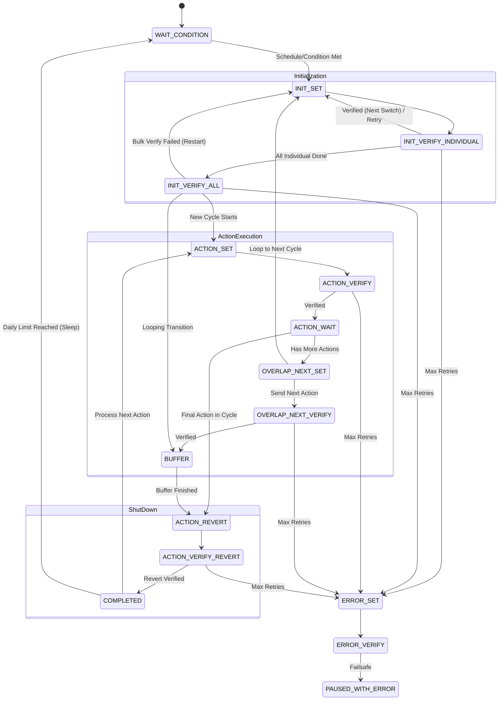

# Cadio Smart Irrigation Automation - Architecture & Flow

This document outlines the complete working mechanics, state machine flow, and AI integration for the Smart Irrigation Automation system.

---

## 1. High-Level Overview

The Smart Irrigation system is a robust, deterministic state machine built in Python (`app.py`). It communicates via MQTT to control relays, valves, and water pumps. 

It ensures that hardware switches are always in a known, safe state through rigorous sequential initialization, verification steps, and safe fallback mechanisms. An offline, edge-capable AI Agent (`ai_agent.py` using Llama 3.2 1B) sits on top of this engine to dynamically calculate watering days based on Open-Meteo weather forecasts.

---

## 2. Core Components

1. **State Machine (`app.py`)**: A tick-based infinite loop running every 1-2 seconds. It evaluates the current `state` of an automation and decides the next action based on timing, MQTT verification, and cycle counts.
2. **AI Scheduling Agent (`ai_agent.py`)**: Uses a local `gguf` model via `llama-cpp-python` to fetch a 7-day forecast and output a JSON list of optimal watering days, completely avoiding rain and prioritizing hot days.
3. **MQTT Dashboard UI (`automation.js`)**: A front-end interface where users define initialization safety states, a sequence of timed actions, max cycles per day, buffer times, and AI scheduling overrides.

---

## 3. The Automation State Machine

The engine transitions between predefined states to ensure complete safety. Below is the complete state machine flow diagram:

### Phase A: Waiting & Checking
* **`WAIT_CONDITION`**: The system is asleep. It wakes up to check:
  1. Is the current day selected in the schedule (or dynamically selected by the AI)?
  2. Is the current time within the allowed `timeRanges` (or is it `is24hr` active)?
  3. Has the system reached its `maxCyclesPerDay` limit?
  *If all conditions are met, it proceeds to Initialization.*

### Phase B: Sequential Initialization (Safety First)
Initialization ensures all valves/pumps are forced to a safe state (e.g., `OFF`) before any watering happens.

* **`INIT_SET`**: Targets the *first* switch in the initialization list and sends an MQTT command to set it to its safe state.
* **`INIT_VERIFY_INDIVIDUAL`**: Waits for the MQTT broker to confirm that specific switch is safe. If it confirms, it loops back to `INIT_SET` to process the *next* switch.
* **`INIT_VERIFY_ALL`**: Once every switch is verified individually, this state does a **final bulk check**. It verifies the whole list simultaneously to ensure no switches drifted back to an unsafe state during the process.
  * *If the bulk check fails, the system restarts the sequence from the beginning.*
  * *If successful, the system transitions to start the Actions.*

### Phase C: Running Actions
Actions are the actual watering steps (e.g., "Zone 1 Valve ON for 10 mins").

* **`ACTION_SET`**: Sends the MQTT command to turn on the target switch for the current action.
* **`ACTION_VERIFY`**: Waits for MQTT confirmation that the switch turned ON. Starts a timer.
* **`ACTION_WAIT`**: The system stays here while the duration timer ticks down. Once time is up, it proceeds to the next action or finishes the cycle.

### Phase D: Cycling & Buffer Transitions
If there are multiple actions, or multiple cycles per day, the system safely transitions between them.

* **`OVERLAP_NEXT_SET` / `OVERLAP_NEXT_VERIFY`**: Handles the transition.
  * If moving from Action 1 to Action 2: It sets Action 2 to ON before reverting Action 1, ensuring continuous pump pressure (if configured).
  * **Looping to a New Cycle**: If the automation finishes its last action and needs to loop to a new cycle (because `cycles_today < maxCyclesPerDay`), the system routes back to **`INIT_SET`** to run the complete sequential initialization flow again, safely shutting everything off before starting the new cycle.
* **`BUFFER`**: A configurable waiting period (e.g., 5 seconds) after the next action/cycle is initialized, allowing water lines to pressurize before the old valves close.

### Phase E: Reverting & Shut Down
* **`ACTION_REVERT`**: Reverts the last active switch back to its original "OFF" state.
* **`ACTION_VERIFY_REVERT`**: Confirms the revert was successful.
* **`COMPLETED`**: Reached at the end of a cycle. 
  * If `cycles_today` < `maxCyclesPerDay`: The system increments the cycle count and loops back.
  * If `cycles_today` == `maxCyclesPerDay`: The system increments the cycle count, flags `stopAfterRevert = True`, performs one final sequential initialization (to ensure all valves close), reverts the last action, and then goes to sleep in `WAIT_CONDITION` until tomorrow.

---

## 4. AI-Driven Scheduling

Instead of static days (Mon/Wed/Fri), users can enable AI scheduling.

1. **Weather Fetching**: The system queries Open-Meteo for the past 3 days and the upcoming 7 days of weather data (max temp, rainfall mm, precipitation probability).
2. **Context Building**: The system provides the AI with:
   * Current soil moisture context (derived from `irrigation_history` and `last_irrigated`).
   * Today's weather and the 7-day forecast.
   * Total water duration of the system.
3. **Local Inference**: The local Llama 3.2 1B Instruct model analyzes the prompt with a low temperature (0.1) for deterministic, logical reasoning.
4. **Resiliency & Retries**: 
   * The prompt is specifically engineered using `DAY1`/`DAY2` placeholders to prevent the small model from hallucinating or copying examples.
   * If the model outputs invalid JSON or incorrect day names, a retry loop increases the temperature slightly (0.10 → 0.25 → 0.40) and tries again up to 3 times to get a valid response.

---

## 5. Error Handling & Recovery

* **Verification Timeouts**: If any switch fails to report its state within `VERIFY_TIMEOUT` (default ~7s), the system increments a retry counter.
* **`ERROR_SET` / `ERROR_VERIFY`**: If a switch fails after `MAX_RETRIES` (default 3), the automation enters an error state. It attempts to force-revert the stuck switch to `OFF`. If it still fails, the automation pauses itself indefinitely and alerts the user on the dashboard.

This architecture ensures that a missed MQTT packet, a rebooting ESP8266 controller, or a WiFi dropout will never result in a valve remaining open indefinitely.
