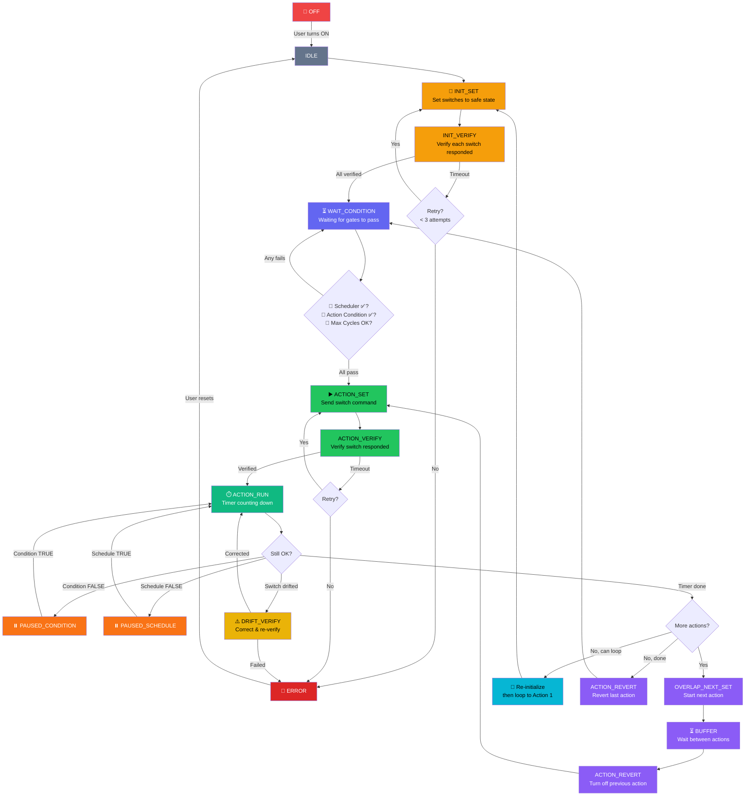
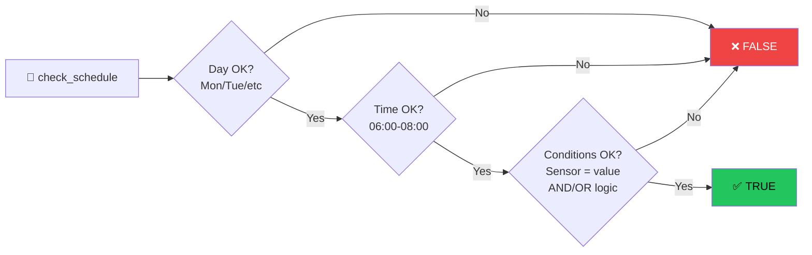
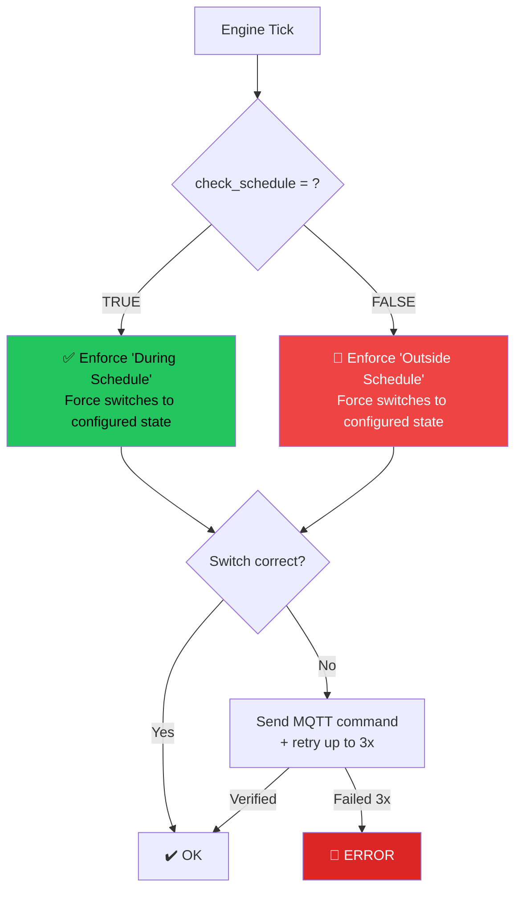
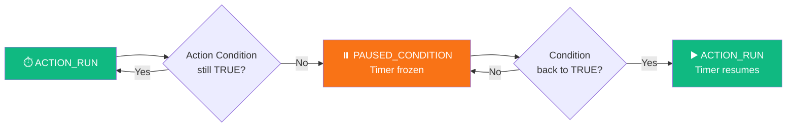
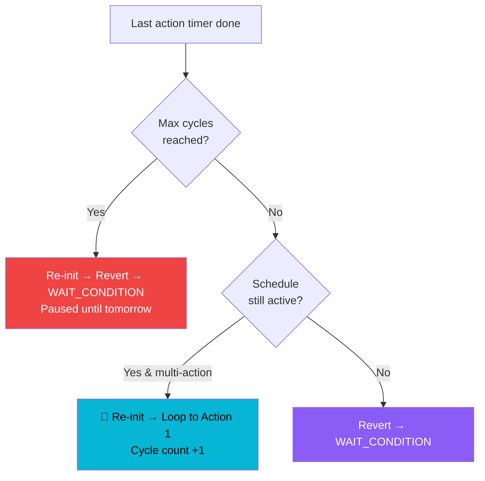

# 🔄 Automation Engine — Complete Flow Diagram

## High-Level Overview

---

## 📅 Scheduler Gate — Detail

The scheduler is checked at **WAIT_CONDITION** and during **ACTION_RUN**. It evaluates 3 sub-gates:

---

## ⚡ Schedule Enforcement — Background

Runs **independently** on every engine tick (regardless of state):

---

## 🔀 Action Condition — During ACTION_RUN

While an action is running, if the action condition becomes false:

---

## 📊 Complete State List

| State | Description |
|:------|:------------|
| `IDLE` | Off, waiting to be turned on |
| `INIT_SET` | Sending initialization switch commands |
| `INIT_VERIFY_INDIVIDUAL` | Verifying each init switch one by one |
| `INIT_VERIFY_ALL` | Final bulk verification of all init switches |
| `WAIT_CONDITION` | Waiting for Scheduler ✅ AND Action Condition ✅ |
| `ACTION_SET` | Sending action switch command |
| `ACTION_VERIFY` | Verifying action switch responded |
| `ACTION_RUN` | ⏱️ Timer running for current action |
| `ACTION_DRIFT_VERIFY` | Switch drifted during run, correcting |
| `OVERLAP_NEXT_SET` | Setting next action while current still active |
| `OVERLAP_NEXT_VERIFY` | Verifying next action switch |
| `BUFFER` | Wait period between actions |
| `BUFFER_DRIFT_VERIFY` | Switch drifted during buffer, correcting |
| `ACTION_REVERT` | Reverting (turning off) previous action |
| `ACTION_VERIFY_REVERT` | Verifying revert succeeded |
| `PAUSED_CONDITION` | ⏸️ Paused — action condition went false |
| `PAUSED_SCHEDULE` | ⏸️ Paused — outside schedule window |
| `PAUSED_USER` | ⏸️ Paused by user manually |
| `PAUSED_ENFORCE` | ⏸️ Pausing to enforce schedule switch |
| `ERROR_SET` | Setting error-state switches |
| `ERROR_VERIFY` | Verifying error-state switches |
| `ERROR` | 🛑 Stuck in error — needs manual reset |
| `COMPLETED` | Cycle completed, transitioning back |

---

## 🔁 Cycle Looping Logic

After the last action finishes:

